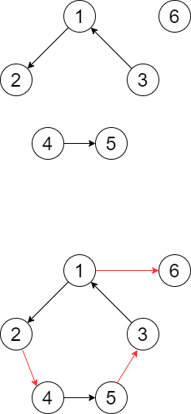

# Extra課題#9

### 問題文
\\(N\\)個の町があり、それぞれ\\(1\\)から\\(N\\)までの番号が付けられています。
また、これらの町同士をつなぐ**一方通行**の道路が\\(M\\)本あり、\\(i\\)番目の道路では町\\(a_i\\)から町\\(b_i\\)へ移動することができます。
初めにあなたは町\\(S\\)にいます。この状態から新たにいくつかの道路を建設して、町\\(S\\)からすべての町へ到達可能となるようにしたいです。(新しく追加する道路も一方通行である必要があります)
この目的を達成するためには最小で何本の道路を新たに建設する必要があるか答えてください。ただし、初めからすべての町へ到達可能である場合は、\\(0\\)を出力してください。

### 制約
- \\(1 \leq N \leq 3000 \\)
- \\(0 \leq M \leq 3000 \\)
- \\(1 \leq S \leq N\\)
- \\(1 \leq a_i,b_i \leq N\\) \\(\( 1\leq i \leq M\) \\)
- \\(a_i \neq b_i\\) \\(\( 1\leq i \leq M\) \\)
- 入力中のすべての値は整数である。

### 入力
以下の形式で標準入力から与えられる。

---

\\(N \quad M \quad S\\)  
\\(a_1 \quad b_1\\)
\\(a_2 \quad b_2\\)
:
\\(a_M \quad b_M\\)

---


### 出力
町\\(S\\)からすべての町へ到達できるようにするために新たに建設する必要のある道路の最小の本数を出力してください。

### 入力例1
```
6 3 1
1 2
3 1
4 5
```

### 出力例1
```
3
```
以下、\\(a_i\\)から\\(b_i\\)へつなぐ道路を\\((a_i,b_i)\\)と表記します。
\\((1,6), (2,4), (5,3)\\)の\\(3\\)本の道路を建設することで町\\(1\\)からすべての町へ到達できるようになります。
建設前と建設後の様子は下図のようになります。
<br>


### 入力例2
```
9 9 1
1 2
1 3
2 3
1 5
5 6
6 1
1 8
9 8
7 1
```
### 出力例2
```
3
```
\\((1,7), (6,4), (7,9),\\)の\\(3\\)本の道路を建設することで町\\(1\\)からすべての町へ到達できるようになります。
\\(\\)